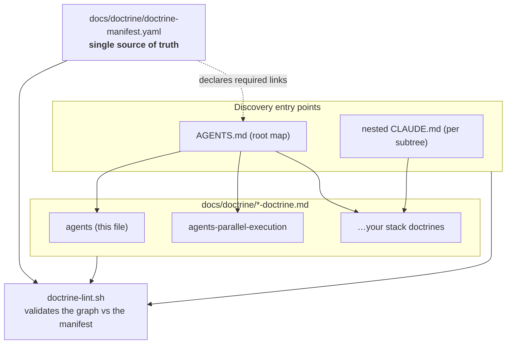
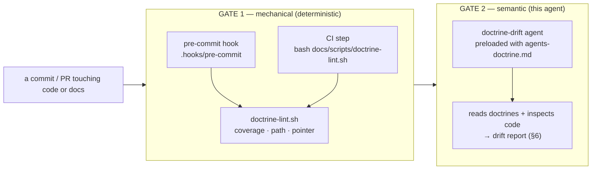
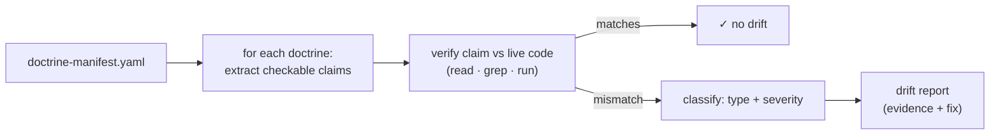

# Docs Doctrine — the doctrine on doctrines (DOCTRINE)

> **The meta-doctrine.** It governs how *all other doctrines* in this repo are written,
> linked, enforced, and kept honest. Two audiences read it:
>
> 1. **Humans / authoring agents** changing anything under `docs/doctrine/` — read §0–§4, §7–§9.
> 2. **The doctrine-drift evaluation agent** — a headless agent preloaded with this file whose job
>    is to detect **doctrine drift** (docs that no longer match the code) *early*. Its operating
>    manual is §5–§6. It reads this doctrine as context, then inspects the doctrines + the code
>    and emits a structured drift report.
>
> Self-contained. You should not need to re-derive the system from the scripts — only to edit it.

## 0. How to use this doc — the reload contract

A **living document**, like every doctrine. When you learn something non-obvious about how the
doctrine system works, breaks, or should be evaluated — **add it here**. Prefer one crisp
symptom→cause→fix line over a paragraph.

This doc is itself a doctrine, so it obeys its own rules: it is registered in
`docs/doctrine/doctrine-manifest.yaml` (id `agents`), and the mechanical linter validates it like
any other.

## 1. What a doctrine is

A **doctrine** is a single, self-contained, reloadable briefing for one domain of this repo —
the durable facts an agent needs to work in that domain without re-reading the source to orient.
Doctrines are the project's long-term memory: knowledge earned the hard way, written down once so
it survives across sessions and agents.

**The family** — the live set is always the manifest (`docs/doctrine/doctrine-manifest.yaml`),
never a hand-kept list here (see §3). The kernel ships two cross-cutting doctrines:

| Doctrine | Governs |
|---|---|
| `agents-doctrine.md` | **this file** — the system that governs all other doctrines |
| `agents-parallel-execution-doctrine.md` | running a bead DAG with parallel subagents on git worktrees |

Add your own stack/domain doctrines (`domain`, `backend`, `frontend`, `infra`, …) with
`/substrate:add-doctrine`; each registers itself in the manifest.

**Conventions (enforced):**
- One file per domain: `docs/doctrine/<id>-doctrine.md`.
- Starts with `# <Title> (DOCTRINE)` and a preload blockquote saying when to load it.
- Lives **only** in `docs/doctrine/`. Planning/spec docs live under `docs/tasks/` (see root `AGENTS.md`).

### 1.1 Root context vs doctrine — trigger vs depth

The repo carries **two** documentation layers. They are **not** redundant — they differ by
*loading mechanics*, and that difference is their whole justification:

| | `AGENTS.md` (root + nested `CLAUDE.md`) | Doctrine (`docs/doctrine/`) |
|---|---|---|
| **Loads** | **auto-injected by proximity** — the harness pulls in a directory's root/nested context (+ ancestors) when you read/edit files in that subtree | **on-demand** — only when something says "context-load this" |
| **Length** | thin (~20–40 lines) | deep (100s of lines) |
| **Role** | "you are *here*; the 2–3 local rules you can't miss; → pointer to the deep doctrine" | the durable depth |

So the root/nested context is the **trigger** tier (right context appears automatically by where
you're working); the doctrine is the **depth** tier. A doctrine can't auto-load by proximity; a
thin context file shouldn't carry depth. A nested `CLAUDE.md` at an architectural boundary is a
*good* pattern for exactly this reason.

**The contract (enforced by judgement in review + the Gate-2 eval, §6):**
- **Thin orientation + a pointer**, never a copy of the doctrine. The day a context file restates
  doctrine content it becomes drift bait → collapse it to a stub + link.
- **Each nested `CLAUDE.md` must say something its parent doesn't.** One that merely echoes the
  directory above is noise to be deleted ("echo-noise", §6.2).
- A subtree's context file **should point to its doctrine(s)**.

## 2. AI coding best practice — how to write & maintain a doctrine

These are the authoring rules. A good doctrine is judged against them; the drift agent (§6) uses
them as its rubric.

1. **Altitude: durable, not transient.** Capture facts that outlive a session — architecture,
   invariants, gotchas, the *why*. Never paste a task's todo list, a transient status, or
   anything the code already states plainly. If it'll be false next week, it doesn't belong.
2. **Link, don't duplicate.** One fact, one home. Cross-reference other doctrines (`[[…]]` /
   relative links) instead of copying. Duplication *is* drift waiting to happen — the copies
   diverge. (The manifest makes the canonical home explicit; see §3.)
3. **Symptom → cause → fix.** Debugging knowledge goes in a cookbook as terse triples, not prose.
4. **Self-contained + reloadable.** A reader (human or agent) should orient from the doctrine
   alone, then jump to source only to *edit*. State the durable facts inline; link for depth.
5. **Ground every claim in something checkable.** Reference real paths, real task names, real
   invariants. A claim a reader can't verify is a claim that will silently rot. This is what
   makes §6's automated drift-evaluation *possible*.
6. **Keep it current as you pass through.** If you touch code that a doctrine describes and the
   doctrine is now wrong, fix the doctrine in the *same* change. Doctrine drift is a bug.
7. **Verify before you trust (and before you recommend).** A doctrine reflects what was true when
   written. If it names a file, symbol, flag, or command, confirm it still exists before acting
   on or repeating it. Stale doctrine is worse than no doctrine — it misleads with authority.

## 3. The manifest — single source of truth

`docs/doctrine/doctrine-manifest.yaml` is the **registry**: every doctrine, plus the docs that
must link to it. Nothing about the doctrine *set* is implicit — the manifest is the law, the
linter enforces it.

```yaml
doctrines:
  - id: agents                                     # file MUST be docs/doctrine/<id>-doctrine.md
    path: docs/doctrine/agents-doctrine.md          # must exist
    pointers: [AGENTS.md]                            # docs that MUST contain a link to this doctrine
    summary: The doctrine on doctrines — …           # one-line "why read this"
```

**Why a manifest at all:** it turns "is every doctrine discoverable and correctly cross-linked?"
from a question nobody answers into a machine-checkable invariant. Add a doctrine → register it
here (and create at least one pointer). Rename/move one → update here + its pointers. The linter
fails the build otherwise. **The manifest is also the entry point the drift agent enumerates** (§6).

## 4. Cross-linking model + architecture

Doctrines form a small graph: the **root map** (`AGENTS.md`) and each subtree's `CLAUDE.md` point
*into* the doctrines; doctrines point *sideways* to siblings. The manifest declares which of those
links are **required** (the `pointers` of each entry), so a rename can't silently orphan a doc.



## 5. Enforcement gates

Two tiers. The **mechanical** gate is cheap, deterministic, and runs on every commit/push. The
**semantic** gate (the drift agent, §6) is deeper, judgement-based, and catches what grep can't.



**Gate 1 — mechanical (`docs/scripts/doctrine-lint.sh`, pure bash, zero deps):**
- **Coverage** — every `docs/doctrine/*-doctrine.md` is registered in the manifest.
- **Existence** — every entry's `path` exists and matches `docs/doctrine/<id>-doctrine.md`.
- **Pointers** — every `pointers[]` file exists *and links to* the doctrine (the rename-rot guard).
- Runs via `bash docs/scripts/doctrine-lint.sh`, called by **both** `.hooks/pre-commit` (local,
  installed by `git config core.hooksPath .hooks`; bypassable with `--no-verify`) **and**
  `.github/workflows/doctrine-lint.yml` (the unbypassable gate).
- **Limits:** it checks *structure* (links resolve, files registered). It cannot tell whether a
  doctrine's *content* is still true. That's Gate 2's job.

**Gate 2 — semantic (the doctrine-drift evaluation agent):** §6.

## 6. The doctrine-drift evaluation protocol (drift agent operating manual)

> You are the doctrine-evaluation agent. You have this file as context. Your mission: **find
> doctrine drift early** — places where a doctrine asserts something the code no longer supports —
> and report it with evidence and a fix, before it misleads the next agent.

### 6.1 Method (per doctrine in the manifest)

1. **Enumerate.** Read `docs/doctrine/doctrine-manifest.yaml`; for each entry, open its `path`.
   Then also enumerate every **`**/CLAUDE.md`** / root `AGENTS.md` — they carry the same kind of
   checkable claims (§1.1) and drift the same way, so they are **in scope** for this eval and its
   report. Skip vendored trees (`node_modules/`, `.venv/`).
2. **Extract checkable claims.** Pull out every assertion a reader could verify against the repo:
   - **Paths/symbols** — anything in backticks that looks like a file, dir, function, route, flag,
     env var, or task name.
   - **Invariants** — sentences with *never / always / must / only / the one rule* (e.g.
     "the frontend never imports backend code", "register `/api` before the SPA fallback").
   - **Commands/tasks** — `make …`, `npm …`, shell snippets.
   - **Status claims** — *shipped / live / pending / reserved / TODO* + any dates/versions.
   - **Interface/shape** — documented signatures, schemas, routes, counts ("11 routes",
     "7 invariants"), mermaid node labels naming real code.
3. **Verify each claim against the live repo.** Use the read/search/run tools: does the path
   exist? does the symbol still have that name/shape? does the command/task exist and (where safe)
   succeed? does the invariant still hold (grep for the forbidden import, the mount order, etc.)?
   does the status match git/code reality?
4. **Classify any mismatch** by the drift taxonomy (§6.2) and **severity** (§6.3).
5. **Emit the report** (§6.4) — evidence + a concrete fix per finding. Do **not** edit doctrines
   yourself unless explicitly asked; your output is the finding.



### 6.2 Drift taxonomy

| Type | The doctrine says… but the code… | Typical signal |
|---|---|---|
| **Path drift** | references a file/dir/symbol | …moved, was renamed, or deleted | backtick path 404s; symbol not found |
| **Invariant drift** | states a never/always/must rule | …now violates it | grep finds the forbidden thing |
| **Interface drift** | documents a signature/route/schema/count | …has a different shape | signature/route mismatch |
| **Command drift** | gives a command/task | …renamed or removed it | script/task missing |
| **Status drift** | says shipped/pending/reserved + dates | …is in a different state | git history / code contradicts |
| **Duplication drift** | states a fact also stated elsewhere | …the two copies disagree | two docs, divergent values |
| **Coverage drift** | (omission) | …a subsystem/area has no doctrine, or a doctrine section is now empty/missing | new top-level dir, undocumented module |
| **Echo-noise** (`CLAUDE.md`) | a nested `CLAUDE.md` repeats its parent / the doctrine | …adds nothing the parent or doctrine doesn't | a nested file whose every claim is already stated above it → flag for prune (§1.1) |

### 6.3 Severity

- **Critical** — would mislead an agent into *breaking* code: invariant or interface drift, a
  wrong "the one rule", a mount-order/contract claim that's now false.
- **Major** — costs real time but won't corrupt code: path/command drift, a dead documented task.
- **Minor** — cosmetic/stale: status words, dates, counts slightly off, prose nits.

### 6.4 Report format (machine-readable, one row per finding)

```
doctrine | section | claim (quoted) | drift_type | severity | evidence (file:line / cmd output) | recommended_fix
```
Lead with a one-line verdict (`N findings: C critical, M major, m minor`), then the table, then a
**completeness note**: which doctrines you fully evaluated, and any claim you *couldn't* verify
(so a human knows the coverage of the pass). Silence is not proof of health — say what you checked.

### 6.5 Tuning the pass
- **Scope to the diff when CI passes a changed-file set** — evaluate doctrines whose domain the PR
  touched first (a backend change → re-check the backend doctrine), then sweep the rest if budget
  allows. Drift is introduced by code changes; follow the change.
- **Prefer false positives you can dismiss over missed Critical drift.** When unsure whether an
  invariant still holds, flag it with your uncertainty rather than assume.
- **Cite, don't assert.** Every finding carries `file:line` or command output. A finding without
  evidence is itself noise.

## 7. Invariants

1. **Every doctrine is registered in the manifest.** No orphans. (Gate 1: coverage.)
2. **The manifest is the only source of truth for the doctrine set + required links.** Don't
   hand-maintain a parallel list anywhere; link to the manifest.
3. **One fact, one home.** Cross-link instead of duplicating; duplication is latent drift.
4. **Doctrine changes ship with the code change that made them true/false.** Drift is a bug, fixed
   at the source, not deferred.
5. **Naming + location are fixed:** `docs/doctrine/<id>-doctrine.md`; nowhere else.
6. **Mechanical gate stays cheap & deterministic; semantic gate stays evidence-based.** Don't push
   judgement work into the linter, or grep work onto the agent.

## 8. Anti-patterns

- **A doctrine that restates the code.** If it's derivable by reading one file, it's not doctrine —
  it's a stale copy. Capture the *why* and the *non-obvious*, not the obvious.
- **Status/TODOs in a doctrine.** Those belong in `docs/tasks/` + tbd beads; they rot fastest.
- **Copy-paste across doctrines.** Two homes for one fact → guaranteed divergence. Link.
- **Adding a doctrine without a manifest entry / pointer.** Gate 1 blocks it; don't `--no-verify`.
- **"Fixing" drift by deleting the inconvenient claim.** If a claim is false, verify reality and
  correct it; don't quietly drop the invariant the claim was protecting.

## 9. Cookbook — authoring & maintenance

**Add a doctrine.** Create `docs/doctrine/<id>-doctrine.md` (title + preload blockquote) → add a
`doctrine-manifest.yaml` entry (`id`, `path`, `pointers`, `summary`) → add the actual link in each
pointer doc (root `AGENTS.md` and/or the subtree `CLAUDE.md`) → `bash docs/scripts/doctrine-lint.sh`
until green → commit (the hook re-checks). `/substrate:add-doctrine` automates the stub + entry.

**Rename/move a doctrine.** `git mv` the file → update its H1 → update the manifest `path` (and the
`id` if the slug changed) → update every pointer's link → grep the repo for the old name → lint →
commit. (This is exactly the rename that motivated Gate 1.)

**Retire a doctrine.** Remove the manifest entry, the file, and inbound pointers together; grep for
dangling references; lint.

**Evaluate for drift (manual or the drift agent).** Follow §6. Quick local smoke:
`bash docs/scripts/doctrine-lint.sh` for structure, then spot-check a doctrine's backticked paths exist.

**Prune CLAUDE.md echo-noise (periodic).** Part of the Gate-2 pass (§6.1 enumerates `**/CLAUDE.md`):
for each nested `CLAUDE.md`, confirm it states something its parent / the doctrine doesn't (§1.1).
A file that only echoes its parent is flagged as echo-noise (§6.2) → collapse to a stub + pointer,
or delete. Keeps the auto-loaded trigger layer thin and worth the context budget.

## 10. Pointers
- `docs/doctrine/doctrine-manifest.yaml` — the registry this doctrine governs.
- `docs/scripts/doctrine-lint.sh` — the mechanical Gate 1 implementation.
- `.hooks/pre-commit`, `.github/workflows/doctrine-lint.yml` — where the gate is wired.
- `AGENTS.md` — the root map; the spec/task lifecycle (`docs/tasks/`) that doctrines must *not* absorb.
- `agents-parallel-execution-doctrine.md` — the parallel-bead orchestration policy.
