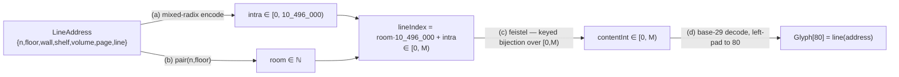

# Content Doctrine — the deterministic library cipher (DOCTRINE)

> **Preload when** you touch `src/domain/content/**` (cipher, codec, permutation,
> alphabet, config), the golden vector, or anything about "what text is at a
> coordinate." Sibling: the lattice/moves/pairing geometry is
> [`coordinate-doctrine.md`](./coordinate-doctrine.md). This is the depth tier; the
> trigger tier is the `src/domain` context. **This is the highest-stakes surface in
> the repo — a silent change here rewrites every book in the Library.**

## 1. High-level summary

Content is a **pure, total, invertible function of a coordinate**. A `LineAddress`
(which room + wall/shelf/volume/page/line) maps deterministically to exactly 80
glyphs, and (almost) any 80 glyphs map back to the address that produces them. It is
one keyed bijection over the space of all possible lines — no storage, no randomness,
no I/O. This is what makes "the same coordinate holds the same book forever, for
everyone" and "type any text and it is found _somewhere_" both true and cheap.

The line-content space has size **`M = 29⁸⁰ ≈ 10¹¹⁷ ≈ 2³⁸⁹`**. Crucially `M = H²`
where `H = 29⁴⁰` — a **perfect square** — which lets a balanced Feistel network be a
_clean bijection with no cycle-walking_. That single algebraic fact is the keystone
of the whole design.

## 2. The pipeline (`line`) and its inverse



`inverse(Glyph[80])` runs it backwards: `base29Encode → feistelInverse →` split into
`room, intra →` **guard: `room ≥ ROOM_MAX ⇒ return null` (E2)** `→ unpair(room) +
decode intra → LineAddress`. Only `< 10.5M` of the ~10¹¹⁷ possible lines return
`null` (the sub-room remainder); everything else resolves to a real coordinate.

## 3. Frozen constants (`content/config.ts`)

| Const                               | Value                             | Note                                                            |
| ----------------------------------- | --------------------------------- | --------------------------------------------------------------- |
| `ALPHABET`                          | `' abcdefghijklmnopqrstuvwxyz,.'` | **29** chars; index 0 = space, 1–26 = a–z, 27 = `,`, 28 = `.`   |
| `RADIX`                             | `29n`                             | base of the content number                                      |
| `COLS`                              | `80`                              | glyphs per line                                                 |
| `WALLS,SHELVES,VOLUMES,PAGES,LINES` | `4, 5, 32, 410, 40`               | Borges intra-room radices                                       |
| `LINES_PER_ROOM`                    | `10_496_000n`                     | `4·5·32·410·40`                                                 |
| `M`                                 | `29n**80n`                        | line-content space; `= H²`                                      |
| `H`                                 | `29n**40n`                        | Feistel half-domain                                             |
| `ROOM_MAX`                          | `M / LINES_PER_ROOM`              | ≈ 2³⁶⁵ addressable rooms                                        |
| `FEISTEL_ROUNDS`                    | `8`                               |                                                                 |
| `R_BYTES`                           | `25`                              | fixed-width big-endian serialisation of `R` (`ceil(log2(H)/8)`) |
| `BABEL_KEY`                         | `utf8Bytes('babel/v1/genesis')`   | genesis key — the seed of the whole library                     |

## 4. Core invariants

1. **Determinism & injectivity.** `line` is a bijective composition (injective codec
   ∘ bijective Feistel ∘ injective base-29), so same address → same line, forever,
   and distinct addresses → distinct lines. No `Date`, no `Math.random`, no I/O. (INV-9/13.)
2. **Both round-trips hold.** `inverse(line(a)) === a` (INV-10) **and**
   `line(inverse(g)) === g` whenever `inverse(g) !== null` (INV-11 — the _search_
   direction; it is the only property that exercises `unpair` at ~2³⁶⁵ scale).
3. **`M = H²`.** The perfect-square identity is load-bearing; a balanced Feistel over
   `[0, H) × [0, H)` is a bijection for _any_ deterministic round function `F`.
4. **`roundKey(i)` depends on `BABEL_KEY` + round index ONLY — never on the room.**
   See §6. This is what keeps the permutation globally invertible.
5. **`bigint` end-to-end.** No `Number()` in the index/content path. (Small intra
   fields are `number` < 2⁵³ and converted with `BigInt(...)` before index math — that
   is the _only_ sanctioned `number`.)
6. **base-29 is big-endian, fixed width 80, left-padded with the index-0 glyph
   (space).** (INV-7.) `R` is serialised to exactly `R_BYTES` big-endian bytes so the
   PRF domain is unambiguous forever (E4).
7. **The golden vector is frozen forever.** `line(origin).join('')` equals a committed
   80-char string (§7). Any change to `ALPHABET`, the radices, `BABEL_KEY`,
   `FEISTEL_ROUNDS`, the pairing, or `F` changes it → INV-14 fails. That is the
   tripwire; it is a _feature_.

## 5. The boundary carve-out — `@noble/hashes` is the ONE allowed external

`src/domain/**` is framework-free by omission: the `boundaries/dependencies` lint
grants `domain` **no** external imports, so `react`/`three`/`convex`/node-core are all
violations. The **single exception** is `@noble/hashes` (audited, zero-dep
SHA-256/HMAC), granted by one narrow rule in `eslint.config.ts`:

```
{ from: { type: 'domain' }, allow: { to: { origin: 'external' },
  dependency: { module: '@noble/hashes' } } }
```

This does **not** weaken the guarantee — every other external is still rejected, and
`pnpm script:verify-boundaries` still proves `domain → react` fails. **Do not broaden
this allow.** If you think `domain` needs another dependency, you almost certainly
want an adapter instead.

## 6. The depth-entropy seam is IMPOSSIBLE — read before "improving" the cipher

There is a recurring temptation (it was in the original brief) to make deeper rooms
"mix differently" by keying `roundKey(i)` on `ring(room)`. **It cannot work and must
never be attempted at the cipher layer.** Trace the inverse:

```
inverse: contentInt → need round keys → need ring → need room → need lineIndex
                                                                  └─ which is what we're decrypting
```

The tweak (`ring`) is part of the plaintext being encrypted and is not recoverable
from the ciphertext without first decrypting → **circular → breaks `inverse()`**.
Two hard consequences, both frozen policy:

- **The Feistel is a single global bijection over all of `[0, M)`.** That globality is
  exactly what scatters any typed string into an unpredictable far room — the "found
  anywhere" magic. Permuting _only within a room_ would restore per-ring keying but
  **kill the magic** (nearby strings → nearby rooms). Don't do it.
- **Depth-dependent behaviour belongs in the render layer**, which stands in a known
  room and therefore _has_ `ring(room)` in the clear. Depth can drive colour, fog,
  glyph treatment, audio — never the invertible core.

## 7. The golden vector — the single most important test in the repo

`tests/unit/domain/content/golden.spec.ts` pins `line(origin)` to a committed 80-char
string (with `BABEL_KEY = 'babel/v1/genesis'`):

```
egfwzeujlb,i,lfqimvdg yjzsctf.xxmi.qe,aalpoedumdoswfpnfewrkhqprsfpgssv pfyfyrumq
```

It is the infrastructure-enforced proof that the library is _actually_ deterministic
across every refactor, dependency bump, and the eventual Rust→WASM swap (which must
reproduce this string byte-for-byte or fail CI). Regenerate it with
`tsx scripts/print-golden.ts` **only if you are deliberately re-founding the library**.
If a dependency bump changes it, **that is real drift — investigate, do not
re-baseline.**

## 8. Gotchas (symptom → cause → fix)

- **`ERR_PACKAGE_PATH_NOT_EXPORTED` importing sha256** → `@noble/hashes` v2 removed the
  `/sha256` subpath and requires the **`.js` suffix**. **Fix:** import
  `sha256` from `@noble/hashes/sha2.js` and `hmac` from `@noble/hashes/hmac.js`.
- **`fast-check` property "fails" on a pure function / shrinks to the origin, but the
  function is provably correct** → the predicate used an **expression-body arrow**
  (`(a) => expect(...).toEqual(...)`) so `expect()`'s return value is handed back to
  fast-check and misread. **Fix:** use a **block body** `(a) => { expect(...) }`. (This
  cost real time during Unit 02 execution — INV-9/INV-10.)
- **`line()` throws `RangeError` on some coordinate** → `pair(n,floor) ≥ ROOM_MAX`
  (E7). Intended: the forward map is total and refuses unaddressable coordinates rather
  than overflowing the Feistel domain. Unreachable for MVP (players are near origin).
- **`inverse()` returned `null`** → the line is in the vanishing unaddressable
  remainder (E2). Callers (Unit 06 search) **must** handle `null` = "exists in the
  library, at no walkable coordinate."
- **A Feistel edit passes some tests but corrupts round-trips** → the inverse must run
  rounds in reverse _and_ recombine correctly: `prevL = ((R - F(i,L)) % H + H) % H;
R = L; L = prevL`. The bug is silent; INV-8/10/11 are the only guards — never disable
  them.
- **Domain coverage gate (≥95% on `src/domain/**`) fails after adding logic** → the
  error branches (E1/E2/E7 throws, `isqrt` guard, byte-width guard) are not reached by
  property tests. Add explicit edge-case assertions (see
  `tests/unit/domain/content/edge-cases.spec.ts`). Note the threshold only fires under
  `vitest run --coverage`, not plain `pnpm test:unit:ci`.
- **`base29Decode` throws "value exceeds 80 digits"** → you fed it `≥ M`. Content ints
  are always `< M`; if you hit this, a prior stage produced an out-of-range value.

## 9. Where this lives / boundaries

- `content/config.ts` constants · `content/bytes.ts` bigint↔bytes · `content/alphabet.ts`
  base-29 · `content/pairing.ts` ℤ²↔ℕ (documented in
  [`coordinate-doctrine.md`](./coordinate-doctrine.md)) · `content/codec.ts` line-index +
  `ROOM_MAX` guards · `content/permutation.ts` Feistel + `roundKey`/`F` ·
  `content/cipher.ts` `line`/`inverse`.
- **Public surface** (frozen barrel `src/domain/index.ts`): `line`, `inverse` + types
  `LineAddress`, `Glyph`. Everything else under `content/` is **private**.
- The port seam is `ContentProvider` (`src/ports/index.ts`, `Address = LineAddress`,
  `Glyph = string`), implemented by `LocalContentProvider`
  (`src/adapters/content/local-content-provider.ts`). A future `WasmContentProvider`
  swaps in here and must reproduce the golden vector.

## 10. Pointers

- [`coordinate-doctrine.md`](./coordinate-doctrine.md) — the lattice, moves, `hash`, and
  the pairing geometry that produces `room`.
- [`tooling-doctrine.md`](./tooling-doctrine.md) — why `scripts/print-golden.ts` is `.ts`
  via `tsx`, and the `substrate.yaml` gate.
- `docs/tasks/completed/02-deterministic-core/deterministic-core-spec.md` — the spec
  (INV-1…INV-14, §4.7 Feistel, §7.1 the impossibility argument in full).
